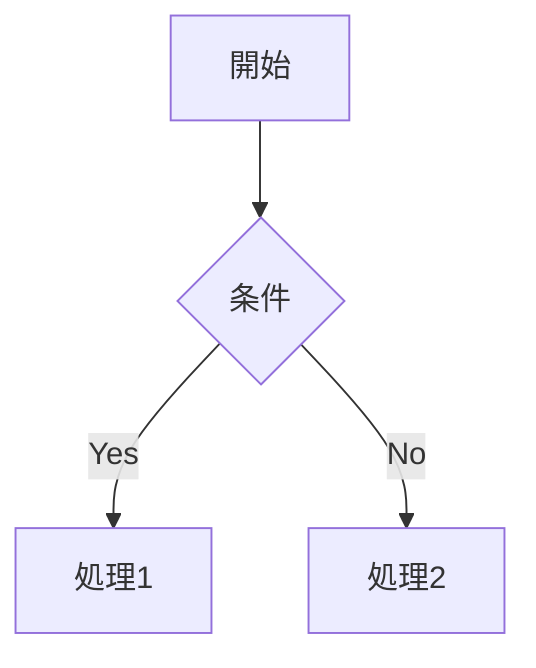

# Zenn Markdown記法リファレンス

Zennの記事・本を執筆する際に使用するMarkdown記法の完全ガイドです。

## 見出し

```
## 見出し2（記事内はh2から始めることを推奨）
### 見出し3
#### 見出し4
```

> アクセシビリティの観点から、記事・本の本文内では `##` から始めることが推奨されています。

---

## テキスト装飾

```
*斜体（イタリック）*
**太字（ボールド）**
~~打消し線~~
`インラインコード`
```

---

## リスト

```
- 箇条書きリスト
- 項目2
  - ネスト（スペース2つ）

1. 番号付きリスト
2. 項目2
```

---

## テーブル

```
| Head | Head |
| ---- | ---- |
| Text | Text |
| Text | Text |
```

セル内改行は `<br>` タグを使用します。

---

## コードブロック

````
```言語名
コード
```
````

ファイル名を表示する場合：

````
```js:ファイル名.js
const foo = 'bar'
```
````

diffハイライト：

````
```diff js
- 削除された行
+ 追加された行
```
````

対応言語はShikiを使用。主な言語：`js` `ts` `go` `python` `ruby` `java` `rust` `bash` `yaml` `json` `html` `css` `sql` `markdown` `mermaid`

---

## 数式（KaTeX）

ブロック数式（前後に空行が必要）：

```
$$
e^{i\theta} = \cos\theta + i\sin\theta
$$
```

インライン数式：

```
$a^2 + b^2 = c^2$ という式があります。
```

---

## 画像

```

```

横幅をpx指定：

```

```

キャプション（画像直下に `*テキスト*`）：

```

*キャプションテキスト*
```

リンク付き画像：

```
[](リンクURL)
```

---

## リンク

```
[アンカーテキスト](URL)
```

---

## リンクカード

URLのみの行で自動的にカード表示：

```
https://zenn.dev
```

または明示的に：

```
@[card](https://zenn.dev)
```

---

## Zenn独自記法：メッセージブロック

情報メッセージ：

```
:::message
メッセージ内容
:::
```

警告メッセージ：

```
:::message alert
警告メッセージ内容
:::
```

---

## Zenn独自記法：アコーディオン（折りたたみ）

```
:::details タイトルテキスト
折りたたまれた内容
:::
```

ネストする場合はコロンを増やします：

```
:::details 外側のタイトル
外側の内容

::::details 内側のタイトル
内側の内容
::::
:::
```

---

## コンテンツ埋め込み

### X（旧Twitter）

```
https://x.com/xxx/status/12345
```

### YouTube

```
https://www.youtube.com/watch?v=xxxxx
```

### GitHub（ファイル・PR・Issue）

```
https://github.com/xxx/yyy/blob/main/README.md
```

### Gist

```
https://gist.github.com/xxx/yyyyyyy
```

### CodePen

```
https://codepen.io/xxx/pen/yyyyy
```

### Figma

```
https://www.figma.com/file/xxxx
```

### StackBlitz

```
https://stackblitz.com/edit/xxxxx
```

---

## ダイアグラム（Mermaid）

````

````

制限：2000文字以内、Chain数10以下。

---

## 脚注

本文中：

```
テキスト[^1]
```

脚注定義（記事末尾などに記載）：

```
[^1]: 脚注の内容
```

---

## HTMLコメント（非表示）

```
<!-- この行は表示されません -->
```

複数行には非対応（1行のみ有効）。

---

## 記事フロントマター

```yaml
---
title: "記事のタイトル"
emoji: "😊"
type: "tech"  # tech: 技術記事 / idea: アイデア記事
topics: ["go", "aws"]  # タグ（英小文字）
published: true  # false: 下書き
published_at: 2026-01-01 08:00  # 任意: 予約公開日時（JST）
---
```

---

## 本のチャプターフロントマター

```yaml
---
title: "チャプターのタイトル"
---
```

---

## Textlintに関する注意事項

- 記事を編集したら必ず `make textlint` でチェックを実行すること
- です/ます調と である/だ 調を混在させない
- 技術用語（ML, AI, LLM, RAG など）はallowlistに登録済み
- 特定の箇所だけチェックを無効化する場合は `<!-- textlint-disable -->` / `<!-- textlint-enable -->` を使用するが、使用は最小限にとどめること
