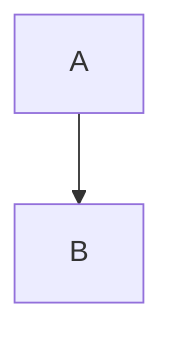

# Zenn Markdown Style Guide

ドキュメント／記事は **Zenn Markdown** を採用します。  
以下のルールとサンプルを守って執筆してください。

公式ガイド: https://zenn.dev/zenn/articles/markdown-guide

## 基本構造

| 要素 | 記法 | 備考 |
| --- | --- | --- |
| 見出し | `#`〜`######` | レベルは 1 記事につき 1 つの `#` を推奨 |
| 段落 | 空行で区切る | 1 行 80〜100 文字程度で改行 |
| リスト | `-` / `1.` | 入れ子は 3 階層まで |

## 強調・引用・区切り線

- **強調**: `**bold**`
- *斜体*: `*italic*`
- ~~取り消し線~~: `~~del~~`
- 引用: `> 引用文`
- 区切り線: `---`

## リンク & カード

- 通常リンク: `[タイトル](URL)`
- URL だけを書くと自動でカード化
- 明示的カード: `@[card](https://example.com)`

## 画像

```markdown


## コードブロック

```lang:file.ext
// コード
```

- 1 行目に **言語名:ファイル名** を書くとタイトルバー表示
- diff は `diff` シンタックスを使用

## テーブル

### サンプル

| 列 1 | 列 2 |
| --- | --- |
| A | B |
| C | D |

## メッセージブロック

### サンプル

:::message alert
注意書きやコールアウトをここに書く
:::

- alert, info, success, warning など種類可


## アコーディオン（トグル）

### サンプル

:::details 見出し
開閉できる詳細コンテンツ
:::

## ダイアグラム



- `mermaid`, `plantuml`, `chart` をサポート
- レンダリング制限: 1 記事 50 ノード程度まで

## インラインコメント

本文に表示しないメモ:

<!-- TODO: 後で図を追加 -->
