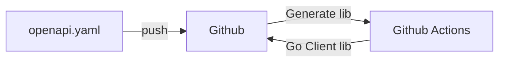

# やりたいこと

OpenAPI Yamlファイルを記述してGithubにPushしたらGithubActionsでOpenAPI Generatorを使ってGoのクライアントライブラリを生成するのを自動化すること。



# やったこと

以下のツールを利用しました。

https://github.com/openapi-generators/openapitools-generator-action

```
on:
  # Triggers the workflow on push or pull request events but only for the main branch
  push:
    branches: [ main ]
    paths:
      - "api/openapi-spec/**"
jobs:
  # This workflow contains a single job called "build"
  generate:
    # The type of runner that the job will run on
    runs-on: ubuntu-latest
    # Steps represent a sequence of tasks that will be executed as part of the job
    steps:
        ~~~~ (中略) ~~~~

      - name: Generate client library for GMO Coin
        uses: openapi-generators/openapitools-generator-action@v1
        with:
          generator: go
          openapi-file: api/openapi-spec/openapi.yaml
          generator-tag: v5.4.0
          command-args: -o client --git-repo-id="gmo-coin-go-sdk/client" --git-user-id="y16ra"

```

１点だけハマったポイントがありました。
`generator-tag` を指定しないで実行したところOpenAPI GeneratorのSNAPSHOTのバージョンで実行されていてビルドの通らないGoのコードが生成されてしまいました。
試しに最新のリリースバージョンを指定(記述時点では `v5.4.0` )したらビルドが通り動くようになりました。

最新のバージョンは以下のリポジトリで確認しましょう。
https://github.com/OpenAPITools/openapi-generator


実際に動かしているものは以下になります。
https://github.com/y16ra/gmo-coin-go-sdk/blob/main/.github/workflows/main.yaml