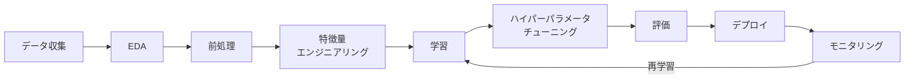

## はじめに

本記事は [AIF-C01（AWS Certified AI Practitioner）受験準備 — 学習記](/articles/f34b4fd13c30a8) の続きです。
ドメイン1「AI/ML の基礎」は出題比率 20％ で、AI・ML の概念・用語・ユースケース・ML 開発ライフサイクルが中心です。

---

## 1.1 基本的な AI/ML の概念と用語

### 基本用語（試験で問われる例）

| 用語 | 説明 |
|------|------|
| AI（人工知能） | 人間の知能を模倣するシステム全般 |
| ML（機械学習） | データから学習し予測・判断する手法 |
| ディープラーニング | 多層ニューラルネットワークを用いた ML |
| ニューラルネットワーク | 層状のノードで表現を学習するモデル |
| コンピュータビジョン | 画像・動画の認識・理解 |
| NLP（自然言語処理） | テキストの理解・生成・分析 |
| モデル（model） | 学習済みの予測・判断を行う関数 |
| アルゴリズム（algorithm） | 学習や推論の手順・方式 |
| 学習（training） | データからモデルを構築する過程 |
| 推論（inferencing） | 学習済みモデルで予測・判断すること |
| バイアス（bias） | データやモデルに含まれる偏り |
| 公平性（fairness） | バイアスが少なく公正であること |
| フィット（fit） | モデルがデータにどれだけ適合しているか |
| LLM | 大規模言語モデル。大規模テキストで事前学習された GenAI の一種 |

### AI / ML / GenAI / ディープラーニングの関係

| 概念 | 説明 |
|------|------|
| AI（人工知能） | 人間の知能を模倣するシステム全般 |
| ML（機械学習） | データから学習し予測・判断する手法。AI の一部 |
| ディープラーニング | 多層ニューラルネットワークを用いた ML の一種 |
| GenAI（生成 AI） | テキスト・画像・音声などを生成するモデル群 |
| LLM | 大規模言語モデル。大規模テキストで事前学習された GenAI の一種 |

AI が最も広い概念で、その中に ML があり、ML の一手法としてディープラーニングがあります。GenAI は目的（生成）に着目した区分で、LLM はその代表例です。

### 学習の種類

| 種類 | 概要 | 例 |
|------|------|-----|
| 教師あり学習 | ラベル付きデータで学習 | 分類、回帰 |
| 教師なし学習 | ラベルなしでパターン発見 | クラスタリング、次元削減 |
| 強化学習 | 報酬・フィードバックで行動を最適化 | ゲーム AI、ロボット制御 |

### 推論の種類

- **バッチ推論**: まとめてデータを処理（夜間バッチなど）
- **リアルタイム推論**: リクエストごとに即時応答（API など）

### AI モデルで扱うデータの種類

| 観点 | 種類 | 例 |
|------|------|-----|
| ラベル | ラベル付き（labeled） | 教師あり学習用の正解付きデータ |
| ラベル | ラベルなし（unlabeled） | 教師なし学習・事前学習用 |
| 形式 | 表形式（tabular） | 行・列の表データ |
| 形式 | 時系列（time-series） | 時点ごとの値 |
| 形式 | 画像（image） | 画像・動画 |
| 形式 | テキスト（text） | 文書・会話 |
| 構造 | 構造化（structured） | スキーマが決まったデータ（DB など） |
| 構造 | 非構造化（unstructured） | 文書・画像・音声など |

---

## 1.2 AI の実用的ユースケース

### AI/ML が価値を出す場面

意思決定支援、スケーラビリティ、自動化などで価値を発揮します。

### AI/ML が不向きな場面

- コスト対効果が合わない場合（cost-benefit の観点）
- 予測ではなく**確定した結果**が必要な場合（deterministic outcome が必要な場面）

### ユースケースと ML 手法の対応

| 手法 | 用途の例 |
|------|----------|
| 回帰（regression） | 売上予測、需要予測 |
| 分類（classification） | スパム判定、不正検知、画像分類 |
| クラスタリング（clustering） | 顧客セグメント、異常検知 |

### 実世界の AI アプリ例

コンピュータビジョン、NLP、音声認識、レコメンド、不正検知、**予測・フォアキャスティング**などです。

### 代表的なユースケースと AWS サービス

| ユースケース | AWS サービス |
|------------|------------|
| テキスト分析・NLP | Amazon Comprehend |
| 音声認識 | Amazon Transcribe |
| 翻訳 | Amazon Translate |
| 対話・チャットボット | Amazon Lex |
| テキスト読み上げ | Amazon Polly |
| 画像・動画分析 | Amazon Rekognition |
| ドキュメント OCR | Amazon Textract |
| レコメンド | Amazon Personalize |
| 不正検知 | Amazon Fraud Detector |

---

## 1.3 ML 開発ライフサイクル

### 関連 AWS サービス

| フェーズ | サービス |
|---------|---------|
| データ準備・EDA | SageMaker Data Wrangler |
| 特徴量管理 | SageMaker Feature Store |
| 学習・デプロイ | Amazon SageMaker |
| モニタリング | SageMaker Model Monitor |

### モデルのソース

ML パイプラインで使うモデルは、主に次の2通りから選びます。

#### 1. 事前学習済みモデル（pre-trained models）

- **概要**: 大規模データで事前に学習済みのモデルをそのまま、または微調整（fine-tuning）して利用します。**オープンソースに限らず**、ベンダー提供のものも含みます。
- **メリット**: 学習コスト・時間を抑えられます。汎用タスク（画像分類、テキスト埋め込み、翻訳など）にすぐ使えます。
- **取得元の例**:
  - **オープンソース**: Hugging Face、PyTorch / TensorFlow のモデル Zoo、学術論文で公開されたモデル
  - **マネージド・商用**: Amazon Bedrock の基盤モデル（Anthropic、Meta、Amazon など）、SageMaker で利用可能なモデル
- **AWS での利用**: [SageMaker JumpStart](https://docs.aws.amazon.com/sagemaker/latest/dg/studio-jumpstart.html) でオープンソース等の事前学習済みモデルをワンクリックデプロイできます。Bedrock では AWS やサードパーティの基盤モデルを API で利用します。

#### 2. 自前で学習したカスタムモデル（custom training）

- **概要**: 自社データを使ってゼロから、またはベースモデルを転移学習・ファインチューニングして学習します。
- **メリット**: ドメイン固有の課題や、自社データに最適化した精度を出しやすいです。
- **向いている場面**: 業界特化（医療、製造、在庫予測など）、ラベル付きデータが十分にある、既存モデルでは精度が足りない場合です。
- **AWS での利用**: [Amazon SageMaker](https://aws.amazon.com/sagemaker/) でデータの準備・学習・チューニング・デプロイを一括して実行できます。分散学習には SageMaker Training を利用できます。

**選択の目安**: 汎用でコストを抑えたいなら事前学習済みモデル。ドメイン特化や高精度のときはカスタム学習を検討します。

### 本番でのモデル利用方法

- **マネージド API サービス**: モデルとインフラの両方を AWS が提供し、API を呼ぶだけで推論できます（例: Bedrock、Rekognition、Comprehend）。
- **自前モデルのデプロイ**: 自分で用意した（または学習した）モデルをデプロイして API 化する方式です。インフラは自前サーバーでも、**SageMaker エンドポイント**のような AWS マネージドでも構いません。試験では「self-hosted API」と書かれることがありますが、SageMaker は自前モデルを AWS 上にホストする形態です。インフラは AWS 管理のため、厳密な意味のセルフホスト（自社サーバー運用）とは異なります。

### MLOps の基本概念

- 実験の管理（experimentation）
- 再現可能なプロセス（repeatable processes）
- スケーラブルなシステム（scalable systems）
- 技術的負債の管理（managing technical debt）
- 本番投入の準備（achieving production readiness）
- モデルモニタリング（model monitoring）
- モデルの再学習（model re-training）

### 主な評価指標（分類）

| 指標 | 概要 |
|------|------|
| 精度（Accuracy） | 正解した割合 |
| 適合率（Precision） | 陽性予測のうち本当に陽性の割合 |
| 再現率（Recall） | 本当の陽性のうち正しく予測できた割合 |
| F1 スコア | 適合率と再現率の調和平均 |
| AUC-ROC | しきい値によらない総合的な分類性能（Area Under the Curve） |

### ビジネス指標（評価に使う例）

- ユーザーあたりコスト（cost per user）
- 開発コスト（development costs）
- 顧客フィードバック（customer feedback）
- 投資対効果・ROI（return on investment）

---

## 試験で押さえるポイント

- **1.1**: 基本用語（AI、ML、ニューラルネットワーク、NLP、コンピュータビジョン、学習/推論、バイアス/公平性、フィット、LLM）。データの種類（ラベル付き/なし、表形式/時系列/画像/テキスト、構造化/非構造化）。階層関係と推論の種類（バッチ/リアルタイム）。教師あり・なし・強化学習の違いとユースケース。
- **1.2**: ユースケースに応じた ML 手法（回帰・分類・クラスタリング）と、AWS マネージド AI/ML サービスの役割。
- **1.3**: ML パイプラインの各フェーズ、モデルのソース（事前学習 vs カスタム）、本番利用方法（マネージド API vs セルフホスト）、MLOps の概念。評価指標（精度・F1・AUC）とビジネス指標（コスト・ROI・フィードバック）の使い分け。

---

## おわりに

個人的にはモデルの評価指標は知らなかったので、今回の試験で勉強になりました。
今回は指標名と概要だけを抑えるところまでの勉強になったので、もう少し深掘りして理解していきたいと思います。
